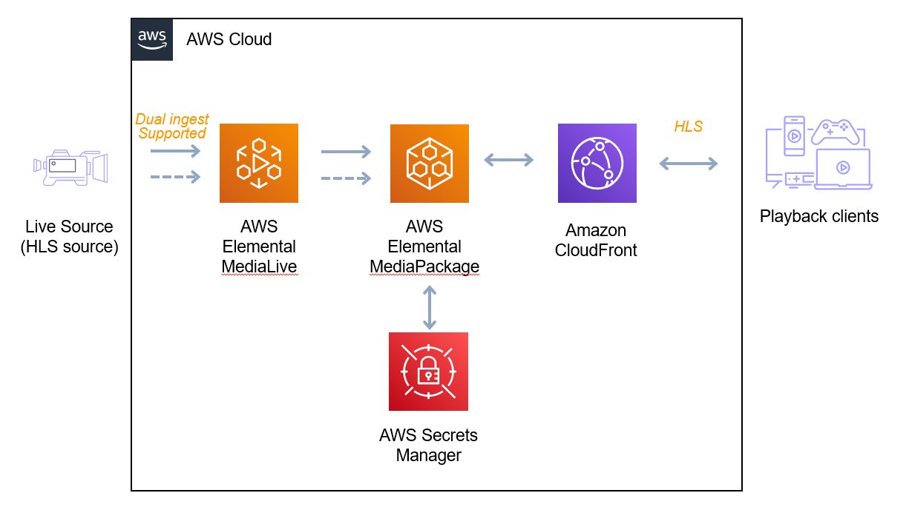
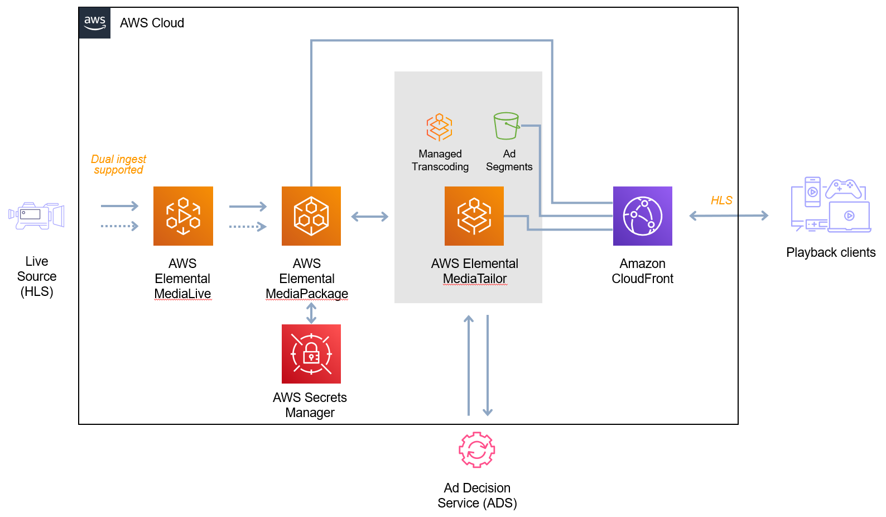
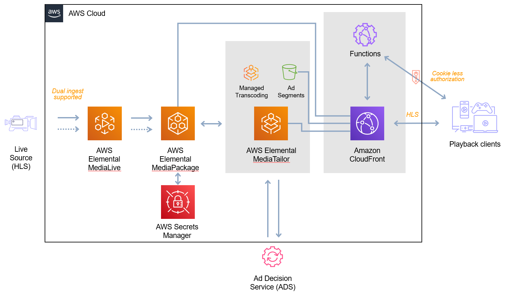
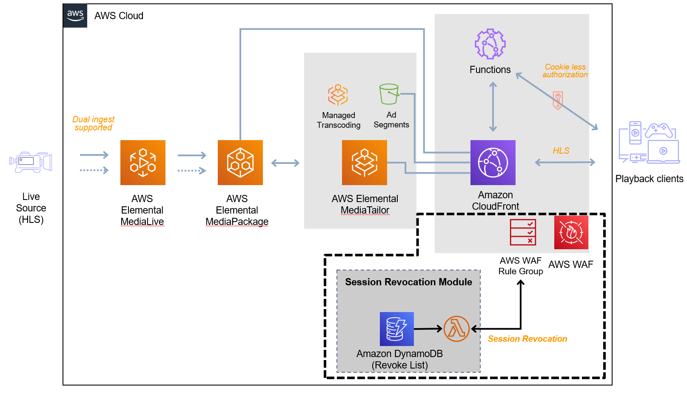
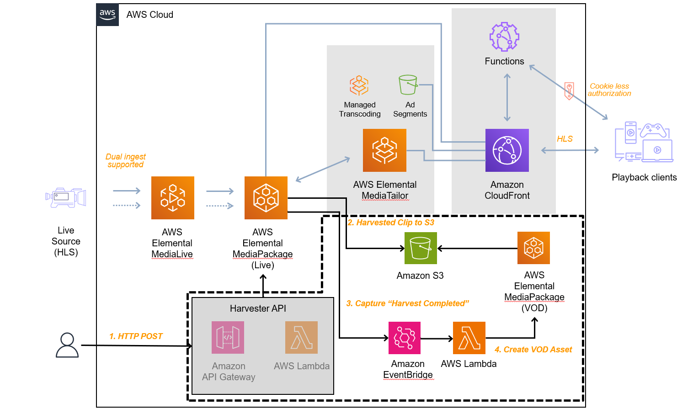
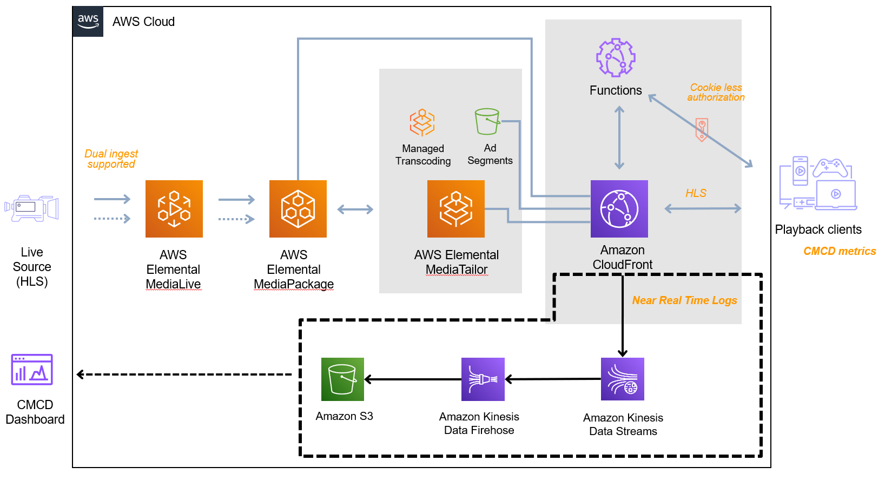

# Build a complete livestreaming workflow using automated deployments

<a name="summary"></a>
## Summary

This workshop is designed and intended for anyone with an interest in learning how to deploy video workflows on AWS Elemental Media Services with a Continuous Integration/Continuous Deployment (CI/CD) approach.
The code in this repository is intended to go along with the Workshop Studio. This workshop has 3 core tasks that should take the duration of the workshop (2 hours) - however if you have time, please look at the advanced topics section
and select one that is most interesting and relevant for you (they all build on from task 3).

<a name="modules"></a>
## Cloning the repo

**Note**: Please be aware that the `main` branch contains the starter of the `workshop` - it is incomplete, so won't compile or deploy.
The first stable branch is `task-1`.

<a name="modules"></a>
## Modules

### Task-1: Deploying a basic Live Streaming Workflow

In this task you will build a basic live streaming workflow using MediaLive, MediaPackage and CloudFront. Along with implementing security features such as Origin protection in MediaPackage and CloudFront.



#### Task-2: Adding Dynamic Ad Insertion to the Live Streaming Workflow

Building on what you built in task 1, you will add in MediaTailor for Dynamic Ad Insertion (DAI) for to demonstrate how to monetize your stream with ads. MediaTailor does this service side (SSAI)



#### Task-3: Adding Token Authorization to the Live Streaming Workflow

Security is important for your live workflows, one of the security measures you can add is our "Secure Media Delivery at the Edge" solution. This allows you to tokenize the URL's you distribute to users.



#### Advanced Topics

If you have time in the workshop, you might want to explore our advanced topics section.

##### Session revocation

Building on the Secure Media Delivery at the Edge solution, you are able to revoke URL's/tokens when necessary. In this task you will use WAF + the session revocation module to block tokens from consuming the stream.



##### Live2VOD: Harvesting VOD

In your workflow, you may require the need to harvest your live streams (i.e. live to VoD). In this task you will implement an API and backend solution to trigger, capture and ingest these clips.
Note: this sample code does not include CloudFront in front of MediaPackage VoD - we recommend you use/add one in your workflows.



##### Adding CMCD

Using telemetry and data for stream quality and performance analysis is vital in any live workflow to both analyse how your CDN is performing and also tying it back with client-side analytics.
In this task we will show you how to use CloudFront realtime logs, and store them into an S3 bucket for further analysis (via Kinesis).



<a name="branch-overview"></a>
## Branch Overview

| Branch  | Overview  | Example Services |
| :------------ |:---------------:| -----:|
| main      | Starter project for the workshop - this has a basic live video workflow included. Starter branch - this is incomplete and will not compile or deploy. | CodePipeline |
| task-1      | Add Media Services to the project         | MediaLive, MediaPackage, CloudFront   |
| task-2 | Building on previous branch, building SSAI into live workflow        |    task-1 + MediaTailor  |
| task-3 | Implement Secure Media Delivery@edge solution with the live SSAI workflow        |    task-2 + CloudFront Functions, Demo Site |
| smd-with-waf | Implement Secure Media Delivery@edge solution with the live SSAI workflow        |    task-3 + WAF |
| live2vod | Add ability to do Live2VOD harvesting off our live video workflow        |    task-3 + Lambda, API Gateway, MediaPackage VoD |
| cmcd | Add ability capture CMCD data from CloudFront logs - in simple form to an S3 bucket        |    task-3 + S3, Kinesis, RealTimeLogConfig

## Deploying the Pipeline

### Find stacks defined in App

For reference, you can find stacks that are available in the CDK app using the following commmand:

```
npm run cdk ls
```

### Stack Diff

If you want to find differences between a stack already deployed in your account, and the CDK App you have locally you can use:

```
npm run cdk diff <stack-name>
```

Note: replacing `<stack-name>` with the stack name you are interested in

### Pipeline Deploy

To deploy the pipeline for the workshop, use the following command:

```
npm run cdk deploy workshop-pipeline-stack
```

## Developer Experience

### Code linting and formatting
In this repository we have used tools such as Prettier and ESLint to keep code formatted and consistent.
This is part of the projects devDependencies - to run these tools you can see the scripts in `package.json`.

## Security

See [CONTRIBUTING](CONTRIBUTING.md#security-issue-notifications) for more information.

<a name="license"></a>
## License

This library is licensed under the MIT-0 License. See the LICENSE file.
